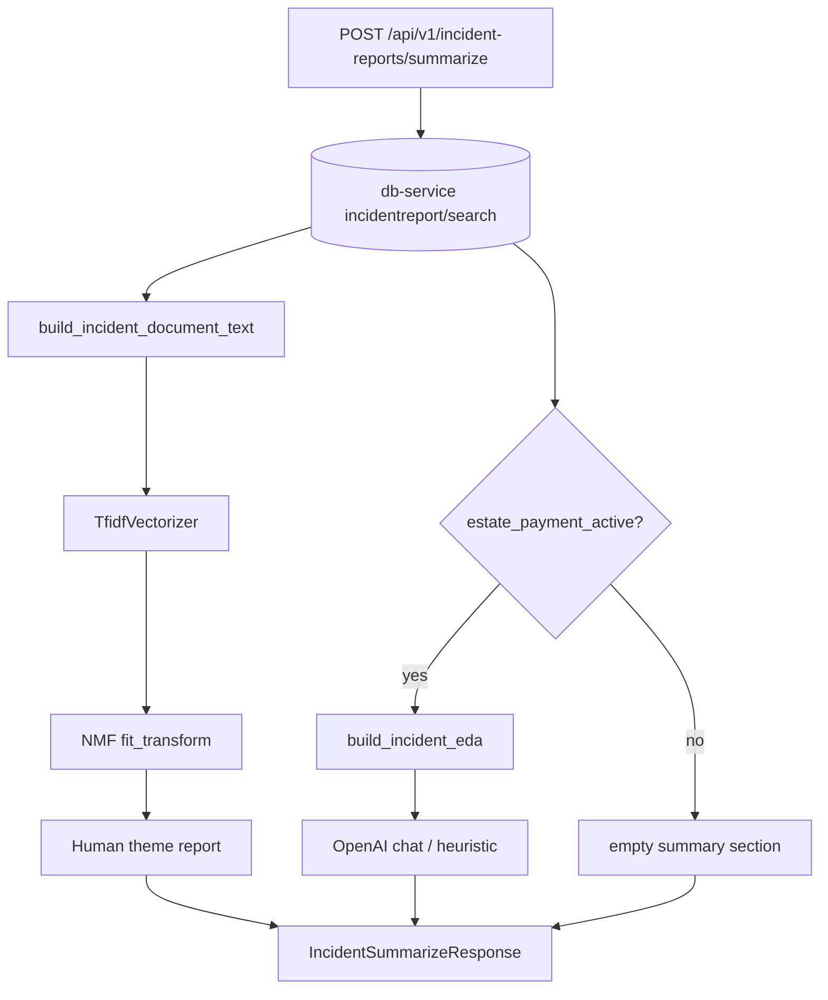

# Incident report intelligence

This document describes how the **ai-service** analyses estate incident cohorts: the
**free** tier (topic modelling only) and the **paid** tier (topics plus EDA and LLM
summary). It explains the end-to-end flow, API contract, and the mathematics behind
TF-IDF and Non-negative Matrix Factorisation (NMF).

For visit anomaly detection (K-means / DBSCAN), see [EXPLAINER.md](EXPLAINER.md) and
the main [README.md](README.md).

---

## Product tiers

| Tier | Gate | Response contents |
|------|------|-------------------|
| **Free** | Always (when incidents exist) | `topics`: TF-IDF + NMF themes, assignments, `report_text`, temporal overview |
| **Paid** | `estate_payment_active == true` | Everything in free, plus `summary`: cohort EDA + structured LLM/heuristic narrative |

Payment is resolved by `fetch_estate_payment_active()` (user-profile estate GET). Until
`core.estates` exposes `payment_status` / `is_paid`, lookups **default to paid** so both
tiers run in development.

---

## End-to-end flow



**Orchestrator:** `app/pipeline/incident_report_orchestrator.py` (`IncidentReportOrchestrator.analyze`)

1. Paginate incident rows for `estate_id` (optional `from_date` / `to_date` on **`created_at`**).
2. **Always** run `discover_incident_topics()` (TF-IDF + NMF + human report).
3. If payment active: `build_incident_eda()` then `summarize_incidents_with_llm()`.
4. Return combined JSON (`estate_id`, `record_count`, `estate_payment_active`, `topics`, `summary`).

**HTTP route:** `app/api/v1/endpoints/incident_report.py`
**Persistence:** `core.incidentreport` in db-service (migration `c17962ae653d`).

---

## API

### Request (`IncidentSummarizeRequest`)

| Field | Meaning |
|-------|---------|
| `estate_id` | Estate UUID |
| `from_date`, `to_date` | Optional bounds on row **`created_at`** (not `occurred_at`) |
| `max_records` | Cap on rows fetched (default 500, max 2000) |
| `n_topics` | Optional NMF component count (2–12); auto if omitted |

### Response (`IncidentSummarizeResponse`)

| Field | Free | Paid |
|-------|------|------|
| `topics` | Populated | Populated |
| `summary.eda` | Empty `{}` | Category/time statistics |
| `summary.structured_summary` | Empty strings / lists | LLM JSON fields |
| `summary.llm_used` | `false` | `true` when OpenAI succeeded |

### Local CLI

From `services/ai_service`:

```bash
poetry run python -m app.pipeline.incident_report_orchestrator \
  --estate-id <uuid> --max-records 100

poetry run python -m app.pipeline.incident_report_orchestrator \
  --json -o /tmp/incident_analyze.json
```

`--json` writes the full payload (including `latency_ms`) to disk.

---

## Document construction

Each incident row becomes one **document** string (`incident_corpus.build_incident_document_text`):

\[
\text{doc}_i = \text{concat}(\text{title}_i,\; \text{categories}_i,\; \text{custom\_category}_i,\; \text{narrative}_i)
\]

Categories are normalised to lowercase enum labels; multi-label rows contribute several tokens.

**Cleaning** (`_clean_document`):

- Lowercase
- Replace non-alphanumeric characters with spaces (keeps `a-z`, `0-9`)

Rows with empty cleaned text are dropped. Topic modelling requires at least **`_MIN_RECORDS = 3`** non-empty documents.

---

## TF-IDF (Term Frequency–Inverse Document Frequency)

We use scikit-learn `TfidfVectorizer` to map each document to a sparse vector in
\(\mathbb{R}^{|V|}\), where \(V\) is the vocabulary (max 4000 features after pruning).

### Term frequency

For document \(d\) and term \(t\), after tokenisation and counting raw frequency
\(\text{tf}_{t,d}\), scikit-learn applies a **sublinear** scaling:

\[
\text{tf}'_{t,d} = 1 + \log(\text{tf}_{t,d}) \quad \text{if } \text{tf}_{t,d} > 0
\]

(Zero stays zero.)

### Inverse document frequency

With document frequency \(\text{df}_t\) (number of documents containing \(t\)) and
\(N\) documents:

\[
\text{idf}_t = \log\frac{1 + N}{1 + \text{df}_t} + 1
\]

(smooth IDF variant used by sklearn.)

### TF-IDF weight

\[
w_{t,d} = \text{tf}'_{t,d} \times \text{idf}_t
\]

The matrix \(\mathbf{X} \in \mathbb{R}^{N \times |V|}_{\geq 0}\) has one row per document.
Entries are L2-normalised per row by default in the vectoriser pipeline used here.

### Vectoriser settings (implementation)

| Parameter | Value | Role |
|-----------|-------|------|
| `ngram_range` | `(1, 2)` | Unigrams and bigrams (e.g. `gate`, `main gate`) |
| `stop_words` | `english` | Remove high-frequency function words |
| `min_df` | `1` if \(N < 10\), else `2` | Drop terms in too few documents |
| `max_df` | `0.95` | Drop terms in >95% of documents |
| `max_features` | `4000` | Vocabulary cap |

---

## NMF (Non-negative Matrix Factorisation)

Given non-negative \(\mathbf{X}\), NMF finds:

\[
\mathbf{X} \approx \mathbf{W} \mathbf{H}
\]

- \(\mathbf{W} \in \mathbb{R}^{N \times K}_{\geq 0}\): **document–topic** weights (soft membership)
- \(\mathbf{H} \in \mathbb{R}^{K \times |V|}_{\geq 0}\): **topic–term** weights
- \(K\): number of topics (`n_components`)

We minimise (Frobenius loss) subject to non-negativity:

\[
\min_{\mathbf{W},\mathbf{H} \geq 0} \;\|\mathbf{X} - \mathbf{W}\mathbf{H}\|_F^2
\]

scikit-learn solves this with **coordinate descent** / multiplicative updates (`max_iter=300`,
`init='nndsvda'`, `random_state=42` for reproducibility).

### Choosing \(K\)

- If `n_topics` is set in the API: \(K = \min(\text{requested}, N-1, 12)\), at least 2.
- Otherwise: \(K = \max(2, \min(8, \lfloor N/8 \rfloor))\), capped by \(N-1\).

Intuition: roughly one latent theme per eight reports, between 2 and 8 topics for typical cohorts.

### Interpreting topics

Row \(k\) of \(\mathbf{H}\) gives term weights for topic \(k\). We surface the top terms:

\[
\text{top}_k = \operatorname{argsort}(\mathbf{H}_{k,:}) \downarrow \;[:8]
\]

### Document assignment

For document \(i\), the **dominant topic** is:

\[
k^\* = \arg\max_{k} \mathbf{W}_{i,k}
\]

The assignment weight reported is \(\mathbf{W}_{i,k^\*}\) (rounded). This is **soft**
clustering: a report can load on several topics, but we expose only the maximum for simplicity.

### Share of cohort

For topic \(k\) with \(n_k\) assigned documents (by argmax) out of \(N\) modelled docs:

\[
\text{share\_percent}_k = 100 \times \frac{n_k}{N}
\]

---

## Temporal overview (descriptive, not part of NMF)

After assignments, `_build_temporal_overview` aggregates:

- Counts per `(topic_id, ISO week)` from `occurred_at` (fallback `created_at`)
- Weekend vs weekday counts
- Coarse **hour buckets**: night (22–06), morning, afternoon, evening

These statistics feed the human `timeline_summary` string; they do not enter the factorisation.

---

## Exploratory data analysis (paid tier)

`build_incident_eda()` computes **frequencies** only (no matrix factorisation):

- Per-label category counts (multi-label rows increment multiple labels)
- `custom_category` distribution
- Rows missing categories, title presence, missing narratives
- Min/max `occurred_at` in the cohort

This JSON is passed to the LLM as structured context. It is also returned under `summary.eda`.

---

## LLM summarisation (paid tier)

When `OPENAI_API_KEY` is set, the service calls the chat completions API with:

- System prompt defining JSON keys: `executive_summary`, `key_patterns`,
  `severity_assessment`, `recommended_actions`, `data_limitations`
- User prompt: EDA JSON + up to 12 truncated incident snippets

`temperature=0.2`, `response_format=json_object`.

If the key is missing or the call fails, `_fallback_summary()` builds a **heuristic**
summary from category counts (no generative model).

The LLM layer does not change topic assignments; it only narrates patterns already
summarised numerically.

---

## Human-readable theme layer

`incident_topic_human_report.py` post-processes NMF output:

1. **Keyword deduplication** — drop redundant unigrams subsumed by selected bigrams.
2. **Theme naming** — rule-based labels (e.g. gate/noise/theft) from keyword fragments.
3. **`report_text`** — plain-text report for operators (themes, shares, examples, timing).

This layer is presentation only; mathematics is unchanged if it were removed.

---

## Module map

| File | Responsibility |
|------|----------------|
| `incident_report_orchestrator.py` | Single entry: fetch, gate, compose response |
| `incident_corpus.py` | Row → document string |
| `incident_topic_modelling.py` | TF-IDF + NMF + temporal stats |
| `incident_topic_human_report.py` | Display names, `report_text` |
| `incident_eda.py` | Paid-tier descriptive stats |
| `incident_llm_summarizer.py` | Paid-tier narrative synthesis |
| `db_service_incident_reports.py` | Paginated db-service search |
| `db_service_estate.py` | Payment gating |
| `models/incident_schemas.py` | Pydantic API models |
| `api/v1/endpoints/incident_report.py` | HTTP handler |

---

## Limitations and assumptions

1. **Short texts** — With few reports or very short narratives, vocabulary is sparse;
   NMF may return generic topics. Minimum three non-empty documents is enforced.
2. **English stop words** — Non-English narratives are not specially handled.
3. **Linear themes** — NMF assumes topics are **non-negative combinations of words**;
   it does not model negation or sarcasm well.
4. **No causal inference** — Correlation of terms across reports is not causation;
   temporal bins are descriptive only.
5. **Payment default** — Development defaults to paid behaviour until estate billing is wired.
6. **Filter field** — API date filters apply to **`created_at`**, not necessarily when the
   incident occurred (`occurred_at` is used for temporal charts only).

---

## References

- Salton & Buckley — TF-IDF weighting schemes
- Lee & Seung (1999) — Algorithms for non-negative matrix factorization
- scikit-learn: `TfidfVectorizer`, `sklearn.decomposition.NMF`
