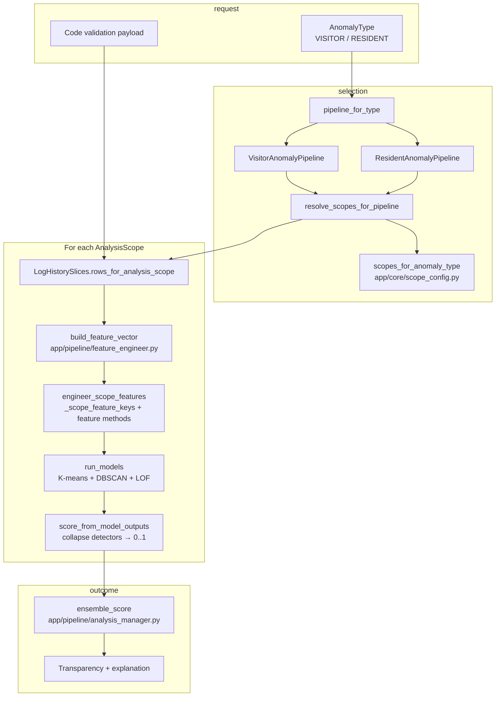

# ai-service (draft)

GatePass **AI microservice** on port **9036** with three capabilities:

1. **Spatial visit anomaly detection** — modular pipeline (scope → data → features → K-means/DBSCAN/LOF →
   ensemble → transparency), pluggable per **analysis scope** (visitor / resident / security /
   estate-wide). Orchestrated by `SpatialAnomalyOrchestrator` in `app/pipeline/spatial_anomaly_orchestration.py`
   and exposed at `POST /api/v1/spatial-anomaly/analyze/{anomaly_type}`.
2. **Temporal visit anomaly detection** — Matrix Profile (stumpy) over a **daily** visit-count series
   built from an estate's **entire** log history. It scores the most recent one-week window against the
   whole history as a discord (errors with `422` if history spans fewer than 21 days). Orchestrated by
   `TemporalAnomalyOrchestrator` in `app/pipeline/temporal_anomaly_orchestration.py` and exposed at
   `POST /api/v1/temporal-anomaly/analyze/{anomaly_type}`, where `anomaly_type` is `visitor`,
   `resident`, or `combined` (merges both streams into one series). The request body is just
   `{ "estate_id": <uuid> }`. Documented in
   **[explainer_docs/TEMPORAL_ANOMALY_MATRIX_PROFILE_EXPLAINER.md](explainer_docs/TEMPORAL_ANOMALY_MATRIX_PROFILE_EXPLAINER.md)**.
3. **Incident report intelligence** — TF-IDF + NMF topic modelling (free) and payment-gated
   EDA + LLM summaries (paid). Documented in **[explainer_docs/INCIDENT_REPORT_SUMMARY_EXPLAINER.md](explainer_docs/INCIDENT_REPORT_SUMMARY_EXPLAINER.md)**.
3. **Validation volume forecasting** — daily visitor / resident / combined validation volume
   forecast per estate using a non-seasonal **ARIMA** model. Orchestrated by
   `VolumeForecastOrchestrator` in `app/pipeline/volume_forecast_orchestrator.py`.

This package is a **draft implementation**: HTTP API + domain enums + ABC-based managers with
db-service integrations. Pub/Sub and incremental counters are still **not** wired on the
anomaly path.

**Port:** `9036` (local and intended K8s service port).

**Next steps:** add weighted/learned ensembling, implement incremental aggregates, and add GCP
Pub/Sub consumer support for the real-time path.

For a **non-technical overview** of K-means, DBSCAN, LOF, and how scores combine, see **[explainer_docs/ANOMALY_DETECTION_EXPLAINER.md](explainer_docs/ANOMALY_DETECTION_EXPLAINER.md)** (includes roadmap TODOs).

---

## Architecture: top-down flow

The service is layered so that **what you are trying to detect** (`AnomalyType`) drives **which
behavioural lenses** run (`AnalysisScope`), which in turn drives **which feature keys** are
computed, then **per-scope scoring**, and finally a **single ensemble** over scopes.

### 1. Anomaly type → pipeline implementation

`AnomalyType` (visitor-centred vs resident-centred) selects a **concrete pipeline** class. That
class owns visitor- vs resident-specific cohort rules and which feature methods exist, while
shared mechanics live on `SpatialAnomalyPipelineBase`.

- **Factory:** `pipeline_for_type` in `app/pipeline/spatial_anomaly_pipeline.py`
- **Types:** `app/domain/anomaly_types.py`

`SpatialAnomalyOrchestrator` constructs the pipeline once per request, then reuses it for every
scope in `app/pipeline/spatial_anomaly_orchestration.py`.

### 2. Anomaly type → analysis scopes (modular config)

**Analysis scopes** are not the same as anomaly type: they describe *which slice of behaviour* we
score (visitor stream, resident stream, guard/security window, estate-wide). Which scopes run
for a request is **static internal configuration** keyed by `AnomalyType`, not something the
client picks per call.

- **Defaults:** `scopes_for_anomaly_type` in `app/core/scope_config.py`
  - Visitor pipelines run **all** `AnalysisScope` values.
  - Resident pipelines run every scope **except** `VISITOR` (resident mode should not execute
    visitor-specific feature sets).
- **Resolution at runtime:** `resolve_scopes_for_pipeline` in `app/pipeline/scope_manager.py`
  simply returns `pipeline.allowed_feature_scopes()`, which delegates to the same config.

This keeps “which lenses exist” in one place; adding a new scope or changing the visitor vs
resident matrix is a **config + enum** change, not a rewrite of the orchestrator loop.

### 3. Analysis scope → rows and feature vector

For each resolved `AnalysisScope`, the orchestrator:

1. Pulls the **pre-wrangled, pre-sliced** rows for that scope from `LogHistorySlices` (see
   `load_log_records_for_analysis` in `app/integrations/db_service_logs.py` and
   `rows_for_analysis_scope` on the slices object).
2. Calls `build_feature_vector` in `app/pipeline/feature_engineer.py`, which delegates to
   `SpatialAnomalyPipelineBase.engineer_scope_features`.

Inside `engineer_scope_features` (`app/pipeline/spatial_anomaly_pipeline.py`):

- `_scope_feature_keys(scope)` returns the **ordered list of design-doc feature keys** for that
  scope only (visitor vs resident vs security vs the combined “all” list used when every scope
  runs).
- Each key maps through `_FEATURE_METHOD_NAMES` to a `_feature_*` method on the same pipeline
  instance, so **feature execution is table-driven** per scope.

So: **scope → subset of keys → subset of `_feature_*` calls → one `dict[str, float]` per scope.**

### 4. Features → anomaly prediction (per scope) → ensemble

Per-scope detectors are implemented (K-means, DBSCAN, LOF); the **scope combiner**
remains a draft unweighted mean until weights are configured:

- **Per scope:** `run_models` in `app/pipeline/analysis_manager.py` consumes the feature vector
  and returns model outputs (``kmeans``, ``dbscan``, ``lof``). The orchestrator then
  calls `score_from_model_outputs` in the same file for a scalar per-scope score in ``[0, 1]``.
- **Across scopes:** `ensemble_score` takes the list of per-scope scores and combines them (today
  an **unweighted mean**; transparency records `ensemble_method` and notes for a future weighted
  or learned ensemble).

Transparency (`ScopeTransparencyDetail`, `AnalysisTransparency`) is built **per scope** from
the same feature dict and model outputs, then attached to the response alongside the final
ensemble score and explanation (`app/pipeline/transparency_manager.py`).

### 5. Persistence after scoring

After scoring, the orchestrator calls db-service `logfeatureengineering/upsert` to persist:

- per-scope engineered feature JSON on `core.logfeatureengineering`,
- anomaly flag (`is_anomalous`) for future historical filtering, and
- prediction payload on `core.predictionresult` as `{"result": <SpatialAnalyzeResponse>}`.

Prediction rows are tagged with enum-backed `prediction_type` values:
`VisitorAnomalyRealtime` or `ResidentAnomalyRealtime`.

### Summary

| Layer | Responsibility |
|--------|------------------|
| `AnomalyType` | Chooses visitor vs resident **pipeline** and **which scopes** run (via config). |
| `AnalysisScope` | Chooses **which row slice** and **which feature key set** is evaluated. |
| `engineer_scope_features` | Maps scope → feature keys → `_feature_*` methods → vector. |
| `run_models` / `score_from_model_outputs` | Per-scope **detection** (K-means, DBSCAN, LOF) and scalar score. |
| `ensemble_score` | **Single** decision from multiple scope scores (unweighted mean; weights TBD). |

To change how scores combine, extend `score_from_model_outputs` and `ensemble_score`
without changing how scopes and feature keys are resolved.

---

## Incident report intelligence

Estate incident cohorts are analysed via `POST /api/v1/incident-reports/summarize`:

- **Free tier:** TF-IDF + NMF topic modelling, per-incident assignments, and human-readable
  `report_text` (always when rows exist).
- **Paid tier:** same topics plus cohort EDA and a structured LLM/heuristic summary when
  `estate_payment_active` is true.

**Full documentation** (API, architecture, TF-IDF and NMF mathematics, hyperparameters,
limitations): **[explainer_docs/INCIDENT_REPORT_SUMMARY_EXPLAINER.md](explainer_docs/INCIDENT_REPORT_SUMMARY_EXPLAINER.md)**.

Local CLI: `poetry run python -m app.pipeline.incident_report_orchestrator --json`

---

## Validation volume forecasting (ARIMA)

Forecast an estate's **daily validation volume** via
`POST /api/v1/volume-forecast/predict/{target}` where `target` is `visitor`, `resident`, or
`combined` (visitor + resident counts summed).

The request body carries the `estate_id`, the look-back window (`history_days`, default 120, or
explicit `from_date`/`to_date`), and the `horizon` (default 14 days). The endpoint returns the
per-day forecast with a 95% confidence interval, the fitted ARIMA order and diagnostics, and a
retrospective backtest RMSE.

Method (per the reference article, in `app/pipeline/arima_forecaster.py`):

1. **Bucket + zero-fill** — validation events from db-service (`visitorlog`/`residentlog` search)
   are counted per calendar day and reindexed over the full window, filling empty days with `0`
   (`app/pipeline/volume_timeseries.py`).
2. **Stationarity** — an Augmented Dickey-Fuller (ADF) test drives the differencing order `d`
   (retested after each difference, up to `d=2`).
3. **Order selection** — a small grid search over `p, q ∈ 0..3` at the chosen `d` keeps the
   lowest-AIC fit (`statsmodels` `ARIMA`).
4. **Forecast** — `get_forecast(steps=horizon)` with a 95% interval; outputs are clipped to
   non-negative integers since volume is a count.
5. **Backtest** — an 80/20 train/test split reports RMSE (`sklearn.metrics.mean_squared_error`).

Guards: fewer than 14 days of history returns HTTP 422; a constant/degenerate series falls back
to a naive constant forecast with an explanatory `notes` field instead of failing.

Non-seasonal ARIMA only; weekly seasonality (SARIMA) is a deliberate future extension.

**Full documentation** (API, series construction, ARIMA/ADF/AIC/RMSE mathematics, limitations):
**[explainer_docs/VOLUME_FORECAST_EXPLAINER.md](explainer_docs/VOLUME_FORECAST_EXPLAINER.md)**.

Local CLI: `poetry run python -m app.pipeline.volume_forecast_orchestrator --target combined --json`
