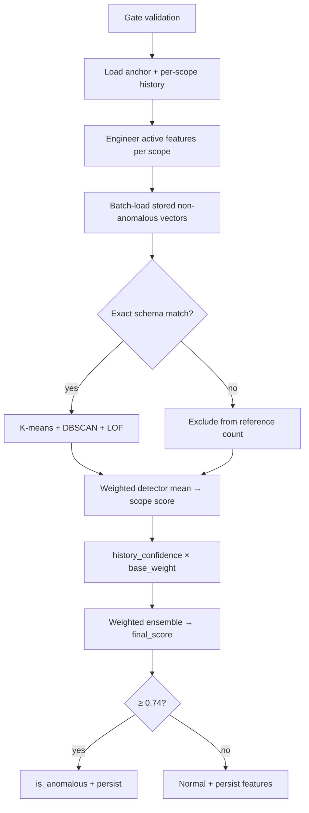

# Spatial Anomaly Model Finetuning — Engineering Record

**Status:** Usable pending next refinement session
**Branch:** `ai-model-finetuning-and-weight-setting`
**Primary estate (validation):** `6eb0c18d-5505-4601-a211-1584b6a5bc31`
**Last updated:** 20 September 2026

**Audience:** Engineering, product, and operations stakeholders posting to Confluence.
**Related docs:** [ANOMALY_DETECTION_EXPLAINER.md](ANOMALY_DETECTION_EXPLAINER.md) (detector intuition), ai-service README.

---

## Executive summary

We completed a three-commit finetuning cycle on the **spatial anomaly** pipeline (visitor and resident gate validations). The work addressed false positives on thin history, schema drift in stored feature vectors, and unweighted ensemble averaging that treated every scope equally.

The model is **production-usable** today: scoring is more stable on first/early visits, stored history aligns with the active feature schema, and severity bands match between ai-service and db-service. A follow-up refinement session should focus on detector hyperparameter grid adoption, threshold calibration from mature-cohort replay, and backfilling the remaining logs without feature-store rows.

---

## Problem statement (before finetuning)

| Symptom | Root cause |
|---------|------------|
| Benign first or second visits flagged anomalous | DBSCAN/LOF spikes on 0–4 reference vectors; all scopes averaged equally |
| Spider plots showed retired features (e.g. time-since-last-visit) | Legacy prediction JSON + inactive keys still rendered in UI |
| Historical vectors mixed old and new schemas | sklearn unioned keys and zero-imputed mismatched dimensions |
| Estate-wide scope dominated noise | Equal weight with visitor/resident-specific lenses |
| Severity inconsistent across services | ai-service threshold vs db-service mapping diverged |

---

## Three-phase evolution (commits)

### Commit 1 — `0de6f62` — Feature schema refactor

**What changed**

- Introduced dedicated **temporal scope** (`features_temporal` column + Alembic migration).
- Centralised **active vs inactive** features in `app/core/feature_config.py`.
- Retired cumulative window counts and duplicate clock features from visitor/resident/security scopes.
- Added **30-day backfill CLI** (`scripts/upsert_visitor_log_features.py`) with schema validation and in-place upsert.

**Why**

- Clock/calendar signals should be scored once, not duplicated per behavioural lens.
- Monotonic counts (total visits, guard totals) skew “normal” as history grows.
- Explicit active config enables exact-key historical matching and safe schema migrations.

### Commit 2 — `06dadba` — Ensemble finetuning + severity alignment

**What changed**

- **History-confidence weighting:** `effective_weight = base_weight × history_confidence`.
- **Scope base weights** tuned by anomaly type (visitor vs resident); estate-wide down-weighted.
- **Detector weights** (K-means 0.35, DBSCAN 0.30, LOF 0.35) replace simple average.
- **Feature contribution** transparency populated from focal z-scores × configured priors.
- **Threshold** raised to **0.74**; severity bands aligned in ai-service and db-service.
- Eval/finetune harness (`spatial_anomaly_eval.py`, `finetune_spatial_anomaly.py`).

**Why**

- Thin cohorts must not drive `final_score` — product policy: absence of history ≠ anomaly.
- Estate-wide cohort is inherently noisier; it should inform, not dominate.
- Operators need explainable contributing factors, not only a scalar score.

### Commit 3 — `d473397` — Per-scope history + feature retirement

**What changed**

- **Per-scope db-service searches** (cap 40 rows each, no shared 30-day slice).
- Scope-specific filters: visitor by `user_id + visitor_fullname`, resident by `estate_id + user_id`, etc.
- Retired **raw time-since-last-visit** features (`visitor_*`, `resident_*`).
- Down-weighted cadence priors (`visitor_weekly_frequency`, `resident_visit_frequency` → **0.6** transparency only).
- Result page filters inactive features from spider plots and contributing factors.

**Why**

- A single calendar window forced the same depth on sparse scopes (one guard) and dense ones (estate-wide).
- Raw elapsed hours penalise long-gap returns; interarrival and smoothed frequency encode cadence without punishing “return after absence.”
- UI must not surface retired keys from older prediction payloads.

---

## Current architecture



### Analysis scopes

| Scope | Active features | History fetch filters |
|-------|-----------------|----------------------|
| **Temporal** | hour_of_day, day_of_week, is_weekend, visit_hour_bucket, night_visit_flag | Focal row only for FE; reference vectors from **resident cohort** |
| **Visitor** | visit_interarrival_time, visitor_weekly_frequency, relationship_transition | `user_id` + `visitor_fullname` |
| **Resident** | visit_interarrival_time, resident_visit_frequency | `estate_id` + `user_id` |
| **Security** | guard_night_validation_frequency, guard_night_validation_share | `estate_id` + `security_id` |
| **Estate-wide** | interarrival + both frequencies + guard night metrics | `estate_id` only |

**Inactive (retired):** visitor_total_visits, guard_total_validations, guard_night_validations, time_since_last_visit, relationship_frequency, resident_time_since_last_visit, visitor_time_since_last_visit.

### Scoring layers

1. **Detectors (per scope):** weighted mean of K-means, DBSCAN, LOF → `scope_score`.
2. **History confidence:** gates scopes with `< 5` matched stored vectors; scales weight by coverage and reference fullness (cap 10).
3. **Ensemble:** weighted mean of `scope_score × effective_weight`.
4. **Decision:** `final_score ≥ 0.74` → anomalous.
5. **Severity:** low &lt; 0.74, medium 0.74–0.79, high ≥ 0.80.

### Transparency vs scoring

| Layer | Affects detectors? | Affects final_score? |
|-------|-------------------|----------------------|
| Feature engineering (active keys) | Yes | Indirectly |
| Feature priors in `ensemble_config.py` | **No** | **No** (spider plot / contributions only) |
| Scope base weights | No | Yes (via ensemble) |
| History confidence | No | Yes (via ensemble) |
| Detector weights | Yes (per scope) | Yes |

---

## Why the current state is better

### 1. Thin-history false positives reduced

Previously, a scope with one stored reference could score highly and count equally in a flat average. Now:

- Scopes with **&lt; 5** matched vectors get `history_confidence = 0` and are **excluded** from the ensemble.
- Partial depth (e.g. 6 of 40 eligible logs with stored features) receives a fractional weight.
- First visits with zero history across scopes yield **`final_score = 0.0`**, not anomalous by default.

**Evidence:** Finetune replay on estate `6eb0c18d…` shows logs with `matched_count = 0–1` and `effective_weight = 0` scoring 0.0 or contributing no weight (see `reports/finetune/finetune_report_20260920T101023Z.json`).

### 2. Schema-safe reference cohorts

Exact-key matching ensures detectors compare apples-to-apples. After backfill refresh:

- **72/72** visitor stored rows match active visitor schema (3 keys per scope column set).
- **21/21** resident stored rows match active resident schema.

Legacy rows with retired keys are excluded (`excluded_schema_mismatch_count` surfaced in transparency) rather than silently zero-imputed.

### 3. Behavioural signal aligned with product policy

- **Removed** raw time-since-last-visit — avoids flagging “returned after a long gap.”
- **Kept** interarrival time and smoothed frequencies — encode cadence without monotonic elapsed-hour bias.
- **Boosted** night-activity transparency priors — aligns with security use cases.
- **Reduced** estate-wide base weight — less noise from broad cohort.

### 4. Operational clarity

- Per-scope fetch traces in ai-service logs (row counts per slice) enable live verification against db-service.
- `transparency.scope_weights[]` exposes base_weight, history_confidence, effective_weight, matched/eligible counts.
- Severity consistent across ai-service and db-service result pages.

### 5. Repeatable migration path

The upsert CLI supports:

```bash
# Schema refresh (no new predictions)
python scripts/upsert_visitor_log_features.py visitor visitor \
  --estate-id <uuid> --features-only --reset-anomalous \
  --include-stored-outside-window
```

Oldest-first processing builds reference depth for later rows in the same batch.

---

## Validation performed

| Check | Result |
|-------|--------|
| Unit tests (feature config, history confidence, db_service_logs, contributions, result page) | Passing in CI/local |
| Estate backfill refresh | Visitor 72/72, resident 21/21 schema-aligned |
| Live per-scope fetch | Logs show split cohorts (e.g. temporal=1, resident=40, visitor=4) |
| Finetune harness Phase 0 | 37-log replay; mature cohort (confidence ≥ 0.8) n=5 |
| Phase 5 threshold recommendation | p99 mature-cohort ≈ **0.738** → adopted **0.74** |
| Phase 6 expert band 0.86–0.92 | 0 cases in band post-weighting (no pending review queue) |

**Finetune report:** `services/ai_service/reports/finetune/finetune_report_20260920T101023Z.json`

---

## Configuration reference

### Runtime (environment / `app/core/config.py`)

| Setting | Value | Purpose |
|---------|-------|---------|
| `ENSEMBLE_ANOMALOUS_SCORE_THRESHOLD` | **0.74** | Anomaly decision boundary |
| `SPATIAL_SEVERITY_HIGH_MIN` | **0.80** | High severity lower bound |
| `SPATIAL_MIN_MATCHED_TO_SCORE` | **5** | Minimum stored refs before scope contributes |
| `SPATIAL_EXPECTED_REFERENCE_CAP` | **10** | “Full” reference depth for confidence |
| `SPATIAL_SCOPE_HISTORY_LIMIT` | **40** | Max log rows fetched per scope search |

### Static priors (`app/core/ensemble_config.py`)

**Visitor scope base weights:** temporal 0.20, visitor 0.30, resident 0.15, security 0.15, estate_wide **0.10**.

**Resident scope base weights:** temporal 0.20, resident **0.35**, security 0.15, estate_wide **0.12**.

**Feature priors (transparency):** night_visit_flag 1.8, relationship_transition 1.4, cadence features 0.6.

---

## Known limitations (accepted for this release)

1. **Missing feature-store rows** — 13 visitor + 16 resident logs in the validation estate have no stored features (not a fetch bug; never backfilled). They reduce `matched_count` until processed.
2. **Thin security cohorts** — Guards with few validations remain low-confidence; by design.
3. **Detector hyperparameter grid** — Finetune Phase 2 recommended K-means p90 / DBSCAN eps 0.5 / LOF inlier max 0.4; **not yet applied** to `config.py` defaults (deferred to next session).
4. **Threshold calibration** — 0.74 is rounded from harness p99; broader multi-estate replay pending.
5. **Expert review batch** — Phase 6 band empty post-fix; no human-labelled regression set yet.

---

## Next refinement session (recommended backlog)

| Priority | Item | Rationale |
|----------|------|-----------|
| P1 | Backfill remaining 29 logs without feature-store rows | Restores reference depth for affected cohorts |
| P2 | Apply Phase 2 detector grid winners to config | Marginal FP reduction on mature cohort |
| P3 | Multi-estate Phase 5 threshold sweep | Confirm 0.74 generalises beyond pilot estate |
| P4 | Labelled expert review set (50–100 cases) | Ground-truth precision/recall tracking |
| P5 | Update ANOMALY_DETECTION_EXPLAINER.md | Remove outdated “double average / TODO” language |
| P6 | Monitor `excluded_schema_mismatch_count` in production | Detect estates needing `--features-only` refresh |

---

## Key files (for engineers)

| Area | Path |
|------|------|
| Per-scope history fetch | `app/integrations/db_service_logs.py` |
| Active feature schema | `app/core/feature_config.py` |
| Ensemble priors | `app/core/ensemble_config.py` |
| History confidence + detectors | `app/pipeline/analysis_manager.py` |
| Orchestrator | `app/pipeline/spatial_anomaly_orchestration.py` |
| Feature contributions | `app/pipeline/feature_contributions.py` |
| Result page (inactive filter) | `app/pipeline/spatial_anomaly_resultpage.py` |
| Backfill CLI | `scripts/upsert_visitor_log_features.py` |
| Finetune CLI | `scripts/finetune_spatial_anomaly.py` |
| db-service severity | `services/db-service/app/core/spatial_scoring.py` |

---

## Glossary

| Term | Meaning |
|------|---------|
| **Anchor** | The focal visit/resident log being scored |
| **Scope** | Behavioural lens (temporal, visitor, resident, security, estate-wide) |
| **Feature store** | `core.logfeatureengineering` — persisted JSON features + prediction results |
| **Matched count** | Stored non-anomalous vectors passing exact active-key match |
| **Eligible count** | Prior log ids in wrangled scope cohort (excluding anchor) |
| **History confidence** | 0–1 multiplier from matched/eligible depth |
| **Thin history** | Fewer than 5 matched references for a scope |

---

## Confluence publishing notes

- Paste this document as a single page under the AI / Anomaly Detection space.
- Attach or link the finetune JSON report as a downloadable artifact.
- Add a “Decision log” panel summarising: threshold 0.74, time-since features retired, per-scope fetch live.
- Link to the deployment ticket / PR for branch `ai-model-finetuning-and-weight-setting`.

---

*Document generated from engineering work on spatial anomaly finetuning, September 2026.*
