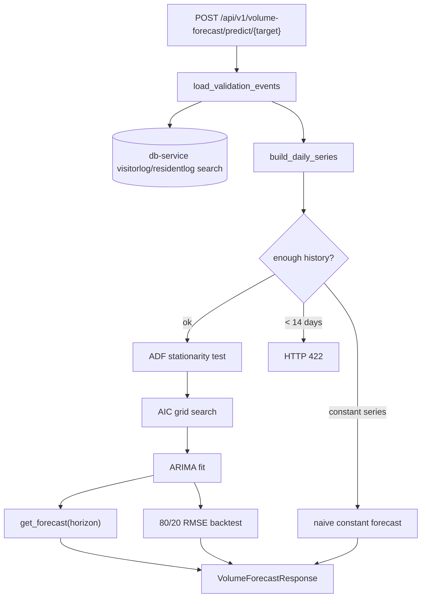

# Validation volume forecasting (ARIMA)

This document describes how the **ai-service** forecasts an estate's **daily validation
volume** — how many visitor and/or resident code validations to expect per day over a
future horizon. It explains the end-to-end flow, the API contract, and the mathematics
behind the **ARIMA** model (stationarity testing, order selection, forecasting, and the
retrospective RMSE backtest).

For visit anomaly detection (K-means / DBSCAN / LOF) see
[ANOMALY_DETECTION_EXPLAINER.md](ANOMALY_DETECTION_EXPLAINER.md); for incident intelligence
(TF-IDF / NMF) see [INCIDENT_REPORT_SUMMARY_EXPLAINER.md](INCIDENT_REPORT_SUMMARY_EXPLAINER.md)
and the main [README.md](../README.md).

---

## What it does

Given an estate and a look-back window, the service counts historical validations into a
**daily time series**, fits a non-seasonal **ARIMA** model, and returns a point forecast
plus a 95% confidence interval for each of the next `horizon` days. It also reports the
selected model order, stationarity diagnostics, and a train/test **RMSE** so callers can
judge forecast reliability.

Three targets are supported through one endpoint:

| Target | Source | Meaning |
|--------|--------|---------|
| `visitor` | `visitorlog` | Visitor code validations only |
| `resident` | `residentlog` | Resident code validations only |
| `combined` | both, summed per day | Total estate validation volume |

---

## End-to-end flow



**Orchestrator:** `app/pipeline/volume_forecast_orchestrator.py`
(`VolumeForecastOrchestrator.forecast`)

1. Resolve the window: `to_date` defaults to now, `from_date` to `now - history_days`.
2. `load_validation_events()` pages db-service log search filtered by `estate_id` and the
   date window, returning parsed event timestamps.
3. `build_daily_series()` counts events per calendar day and **zero-fills** every empty day.
4. `run_forecast()` runs ADF → order selection → fit → forecast → backtest.
5. Return combined JSON (`target`, `observations`, `model`, `backtest`, `forecast`, `notes`).

**HTTP route:** `app/api/v1/endpoints/volume_forecast.py`
**Data source:** `core.visitorlog` / `core.residentlog` via db-service `codeservice` search.

---

## API

### Request (`VolumeForecastRequest`)

| Field | Meaning | Default | Bounds |
|-------|---------|---------|--------|
| `estate_id` | Estate UUID | required | — |
| `history_days` | Look-back length when dates omitted | `120` | 30–730 |
| `horizon` | Days to forecast ahead | `14` | 1–60 |
| `from_date`, `to_date` | Explicit UTC window override | `null` | — |
| `max_records` | Cap on rows pulled before bucketing | `5000` | 1–50000 |

`target` is a **path** parameter: `visitor`, `resident`, or `combined`.

### Response (`VolumeForecastResponse`)

| Field | Meaning |
|-------|---------|
| `target`, `estate_id`, `bucket` | Echo of the request; `bucket` is always `"daily"` |
| `observations` | Number of **non-zero** days in the history window |
| `history_start`, `history_end` | First/last day of the modelled series (`YYYY-MM-DD`) |
| `model.order` | Selected `[p, d, q]` |
| `model.aic` | Akaike Information Criterion of the fit (`null` for naive fallback) |
| `model.adf_statistic`, `model.adf_pvalue` | ADF test on the original series |
| `model.differencing_applied` | The chosen `d` |
| `model.is_stationary` | Whether the series was stationary after differencing |
| `backtest` | `{ rmse, train_size, test_size }` or `null` when skipped |
| `forecast` | List of `{ date, predicted, lower, upper }` (95% interval) |
| `notes` | Populated only for the naive fallback path |

### Local CLI

From `services/ai_service`:

```bash
poetry run python -m app.pipeline.volume_forecast_orchestrator \
  --estate-id <uuid> --target combined --history-days 120 --horizon 14

poetry run python -m app.pipeline.volume_forecast_orchestrator \
  --target visitor --json
```

`--json` prints the full payload (including `latency_ms`) to stdout.

---

## Series construction

Validation rows are reduced to their **event timestamp**, taken from the first present of
`visit_time` → `access_time` → `created_at` (`db_service_validation_volume.py`). Each
timestamp is normalised to a tz-naive **UTC day** (floored to midnight).

`build_daily_series()` (`volume_timeseries.py`) then:

1. Counts events per day: \( c_\tau = \lvert\{\, e : \text{day}(e) = \tau \,\}\rvert \).
2. Reindexes onto the **full** contiguous daily range \([\text{start}, \text{end}]\),
   filling absent days with **0**.

\[
y_\tau =
\begin{cases}
c_\tau & \text{if validations occurred on day } \tau\\
0 & \text{otherwise}
\end{cases}
\qquad \tau = \text{start}, \dots, \text{end}
\]

**Why zero-fill matters:** validation activity is sparse and gappy, unlike the continuous
daily series in the classic ARIMA tutorial. ARIMA requires a regular, contiguous index;
skipping empty days would distort the temporal spacing and bias the model.

The `combined` target sums the two streams because both are bucketed onto the same daily
index before modelling.

---

## ARIMA in brief

**ARIMA(p, d, q)** — AutoRegressive Integrated Moving Average — models a single series
using three parts:

- **AR(p)** — the value depends linearly on its own \(p\) previous values.
- **I(d)** — the series is **differenced** \(d\) times to remove trend and become stationary.
- **MA(q)** — the value depends on the previous \(q\) forecast errors (shocks).

Let \(B\) be the backshift operator (\(B y_t = y_{t-1}\)) and \(\nabla = 1 - B\) the
differencing operator. The model is:

\[
\phi(B)\,(1-B)^{d} y_t = \theta(B)\,\varepsilon_t
\]

with

\[
\phi(B) = 1 - \sum_{i=1}^{p}\phi_i B^{i}, \qquad
\theta(B) = 1 + \sum_{j=1}^{q}\theta_j B^{j}, \qquad
\varepsilon_t \sim \text{WN}(0, \sigma^2).
\]

The coefficients \(\{\phi_i\}\), \(\{\theta_j\}\) are estimated by maximum likelihood
(`statsmodels.tsa.arima.model.ARIMA`).

---

## Step 1 — Stationarity: the ADF test

ARIMA's AR and MA parts assume a **stationary** series (constant mean/variance over time).
We test this with the **Augmented Dickey-Fuller (ADF)** test (`statsmodels ... adfuller`),
which tests for a unit root by regressing:

\[
\Delta y_t = \alpha + \beta t + \gamma\, y_{t-1}
           + \sum_{k=1}^{m}\delta_k \Delta y_{t-k} + \varepsilon_t
\]

- **Null hypothesis \(H_0\):** \(\gamma = 0\) — a unit root is present (**non-stationary**).
- **Alternative \(H_1\):** \(\gamma < 0\) — the series is **stationary**.

We reject \(H_0\) (declare stationary) when

\[
p\text{-value} \le \alpha, \qquad \alpha = 0.05 \;(\texttt{STATIONARITY\_ALPHA}).
\]

### Choosing the differencing order `d`

`_select_d()` applies the test iteratively:

1. Run ADF on the raw series. If stationary → \(d = 0\).
2. Otherwise difference once (\(\nabla y\)), re-test; if stationary → \(d = 1\).
3. Repeat up to \(\texttt{MAX\_D} = 2\). If still non-stationary, use \(d = 2\) and flag
   `is_stationary = false`.

The reported `adf_statistic` / `adf_pvalue` are always those of the **original** series.

---

## Step 2 — Order selection: AIC grid search

With `d` fixed, `_select_order()` searches all combinations

\[
p \in \{0,\dots,3\}, \quad q \in \{0,\dots,3\}, \quad (p,q) \ne (0,0)
\]

(`MAX_P = MAX_Q = 3`), fits each candidate, and keeps the one minimising the **Akaike
Information Criterion**:

\[
\text{AIC} = 2k - 2\ln(\hat{L})
\]

where \(k\) is the number of estimated parameters and \(\hat{L}\) the maximised likelihood.
AIC rewards goodness of fit while penalising complexity, guarding against overfitting.
Candidate fits that fail to converge are caught and skipped; if none succeed the default
\((1, d, 0)\) is used.

This automation replaces the manual ACF/PACF inspection from the reference tutorial while
following the same underlying principle.

---

## Step 3 — Forecast

The best model is refit on the full series and projected forward:

\[
(\hat{y}_{T+1}, \dots, \hat{y}_{T+h}) = \texttt{get\_forecast}(h)
\]

for horizon \(h\). Each step also yields a **95% confidence interval**
(`conf_int(alpha=0.05)`):

\[
\big[\hat{y}_{T+i} - 1.96\,\sigma_i,\; \hat{y}_{T+i} + 1.96\,\sigma_i\big]
\]

where \(\sigma_i\) is the forecast standard error at step \(i\).

**Post-processing** (`_clip_round`): validation counts are non-negative integers, so every
`predicted`, `lower`, and `upper` value is clipped at 0 and rounded:

\[
\text{out} = \max\!\big(0, \operatorname{round}(v)\big).
\]

Future dates are the \(h\) calendar days immediately following the last observed day.

---

## Step 4 — Backtest (RMSE)

`_backtest()` measures accuracy on held-out data using an **80/20 chronological split**:

- `train_size = ⌊0.8 · N⌋`, `test_size = N − train_size`.
- Refit ARIMA (same order) on the training span, forecast `test_size` steps, and compare to
  the actual held-out days.

The reported metric is **Root Mean Squared Error**:

\[
\text{RMSE} = \sqrt{\frac{1}{n}\sum_{i=1}^{n}\big(y_i - \hat{y}_i\big)^2}
\]

(`sklearn.metrics.mean_squared_error`, then square-root). Lower is better; RMSE is in the
same units as the series (validations/day). The backtest is **skipped** (`backtest = null`)
when `train_size < 14` or `test_size < 1`, and is best-effort — a fit failure yields `null`
rather than an error.

---

## Guards and fallbacks

| Condition | Behaviour |
|-----------|-----------|
| Fewer than `MIN_OBSERVATIONS = 14` days in the series | Raise `VolumeForecastError` → **HTTP 422** |
| Constant / all-zero series (`std == 0`) | Skip ARIMA; return a **naive constant** forecast at the last level, `order = [0,0,0]`, `notes` explains why |
| ARIMA fit/forecast raises | Log a warning and fall back to the naive constant forecast |
| Individual grid-search fits fail | Skipped silently; best surviving order (or default) is used |

These keep a single sparse or degenerate estate from producing a 500 error.

---

## Module map

| File | Responsibility |
|------|----------------|
| `api/v1/endpoints/volume_forecast.py` | HTTP handler, auth, error mapping |
| `pipeline/volume_forecast_orchestrator.py` | Single entry: fetch → bucket → forecast; CLI harness |
| `integrations/db_service_validation_volume.py` | Paginated visitor/resident log search → timestamps |
| `pipeline/volume_timeseries.py` | Zero-filled daily count series |
| `pipeline/arima_forecaster.py` | ADF, AIC grid search, forecast, RMSE backtest, guards |
| `models/forecast_schema.py` | Pydantic request/response models |
| `domain/forecast_target.py` | `ForecastTarget` enum (visitor/resident/combined) |
| `core/exceptions.py` | `VolumeForecastError` |

---

## Limitations and assumptions

1. **Non-seasonal only.** The model captures trend and short-run autocorrelation but not
   weekly cycles. Real gate traffic often has strong day-of-week seasonality; **SARIMA**
   is a deliberate future extension.
2. **Daily granularity.** Sub-daily patterns (rush hours) are aggregated away.
3. **Short/sparse history.** With little activity, differencing and MLE are unstable; the
   14-day minimum and constant-series fallback bound the worst cases, but forecasts on thin
   data should be treated as indicative only.
4. **Integer counts vs. Gaussian model.** ARIMA assumes Gaussian errors; validation counts
   are non-negative integers (closer to Poisson). Clipping/rounding is a pragmatic fix, not
   a change of likelihood — expect wide intervals on low-volume estates.
5. **Point-in-time window.** `from_date`/`to_date` filter on the log **event time**; late or
   backfilled rows outside the window are excluded.
6. **No persistence.** Forecasts are computed on demand and not stored (unlike the anomaly
   path's feature-store writes).

---

## References

- Box, Jenkins & Reinsel — *Time Series Analysis: Forecasting and Control* (ARIMA)
- Dickey & Fuller (1979) — Distribution of estimators for autoregressive time series with a unit root
- Akaike (1974) — A new look at the statistical model identification (AIC)
- statsmodels: `statsmodels.tsa.arima.model.ARIMA`, `statsmodels.tsa.stattools.adfuller`
- scikit-learn: `sklearn.metrics.mean_squared_error`
- Reference tutorial: [*Time Series Analysis and Forecasting with ARIMA in Python*](https://medium.com/datainc/time-series-analysis-and-forecasting-with-arima-in-python-aa22694b3aaa) (The ML Classroom)
