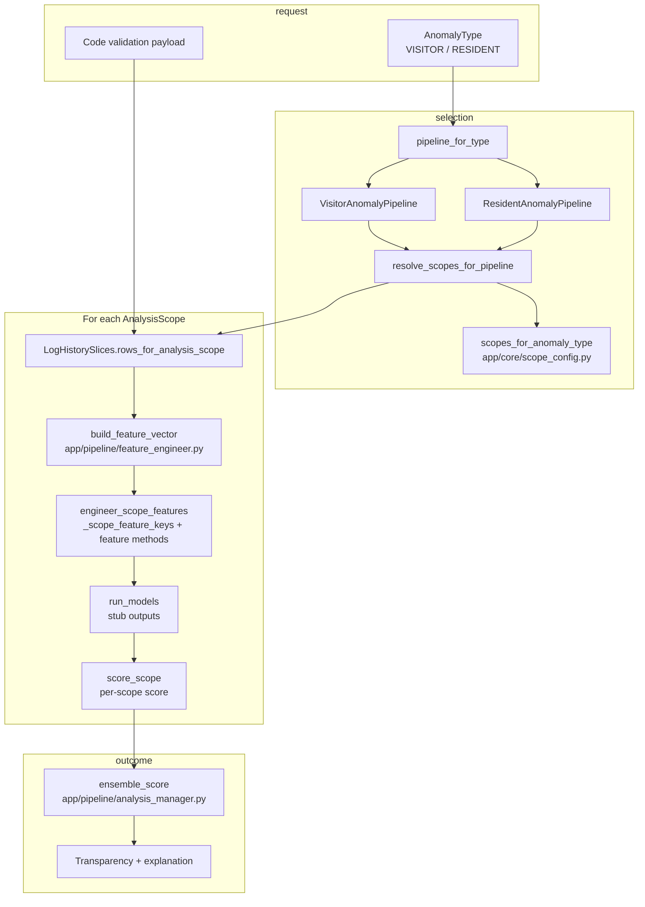

# anomaly-service (draft)

Implements the **Visit Anomaly Detection** slice from the GatePass design doc: modular
pipeline (scope → data → features → analysis → transparency), pluggable per **analysis scope**
(visitor / resident / security / estate-wide).

This package is a **scaffold**: HTTP API + domain enums + ABC-based managers with stub
implementations. ML (K-means, DBSCAN, LFOA ensemble), Pub/Sub, feature store tables, and
incremental counters are **not** wired yet.

**Port:** `9035` (local and intended K8s service port).

**Next steps:** connect to `db-service` / visit log APIs, add Alembic migrations for feature-store
tables, implement incremental aggregates, add GCP Pub/Sub consumer for real-time path.

---

## Architecture: top-down flow

The service is layered so that **what you are trying to detect** (`AnomalyType`) drives **which
behavioural lenses** run (`AnalysisScope`), which in turn drives **which feature keys** are
computed, then **per-scope scoring**, and finally a **single ensemble** over scopes.

### 1. Anomaly type → pipeline implementation

`AnomalyType` (visitor-centred vs resident-centred) selects a **concrete pipeline** class. That
class owns visitor- vs resident-specific cohort rules and which feature methods exist, while
shared mechanics live on `AnomalyPipelineBase`.

- **Factory:** `pipeline_for_type` in `app/pipeline/anomaly_pipeline.py`
- **Types:** `app/domain/anomaly_types.py`

The orchestrator constructs the pipeline once per request, then reuses it for every scope in
`app/pipeline/orchestrator.py` (`AnomalyOrchestrator.analyze`).

### 2. Anomaly type → analysis scopes (modular config)

**Analysis scopes** are not the same as anomaly type: they describe *which slice of behaviour* we
score (visitor stream, resident stream, guard/security window, estate-wide). Which scopes run
for a request is **static internal configuration** keyed by `AnomalyType`, not something the
client picks per call.

- **Defaults:** `scopes_for_anomaly_type` in `app/core/scope_config.py`
  - Visitor pipelines run **all** `AnalysisScope` values.
  - Resident pipelines run every scope **except** `VISITOR` (resident mode should not execute
    visitor-specific feature sets).
- **Resolution at runtime:** `resolve_scopes_for_pipeline` in `app/pipeline/scope_manager.py`
  simply returns `pipeline.allowed_feature_scopes()`, which delegates to the same config.

This keeps “which lenses exist” in one place; adding a new scope or changing the visitor vs
resident matrix is a **config + enum** change, not a rewrite of the orchestrator loop.

### 3. Analysis scope → rows and feature vector

For each resolved `AnalysisScope`, the orchestrator:

1. Pulls the **pre-wrangled, pre-sliced** rows for that scope from `LogHistorySlices` (see
   `load_log_records_for_analysis` in `app/integrations/db_service_logs.py` and
   `rows_for_analysis_scope` on the slices object).
2. Calls `build_feature_vector` in `app/pipeline/feature_engineer.py`, which delegates to
   `AnomalyPipelineBase.engineer_scope_features`.

Inside `engineer_scope_features` (`app/pipeline/anomaly_pipeline.py`):

- `_scope_feature_keys(scope)` returns the **ordered list of design-doc feature keys** for that
  scope only (visitor vs resident vs security vs the combined “all” list used when every scope
  runs).
- Each key maps through `_FEATURE_METHOD_NAMES` to a `_feature_*` method on the same pipeline
  instance, so **feature execution is table-driven** per scope.

So: **scope → subset of keys → subset of `_feature_*` calls → one `dict[str, float]` per scope.**

### 4. Features → anomaly prediction (per scope) → ensemble

Today this layer is intentionally stubbed but the **wiring** matches the intended production shape:

- **Per scope:** `run_models` in `app/pipeline/analysis_manager.py` consumes the feature vector
  and returns placeholder model outputs (e.g. k-means / DBSCAN / LFOA-style keys). The
  orchestrator also calls `pipeline.score_scope(scope, feats)` for a scalar per-scope score.
- **Across scopes:** `ensemble_score` takes the list of per-scope scores and combines them (today
  an **unweighted mean**; transparency records `ensemble_method` and notes for a future weighted
  or learned ensemble).

Transparency (`ScopeTransparencyDetail`, `AnalysisTransparency`) is built **per scope** from
the same feature dict and model outputs, then attached to the response alongside the final
ensemble score and explanation (`app/pipeline/transparency_manager.py`).

### Summary

| Layer | Responsibility |
|--------|------------------|
| `AnomalyType` | Chooses visitor vs resident **pipeline** and **which scopes** run (via config). |
| `AnalysisScope` | Chooses **which row slice** and **which feature key set** is evaluated. |
| `engineer_scope_features` | Maps scope → feature keys → `_feature_*` methods → vector. |
| `run_models` / `score_scope` | Per-scope **detection** inputs (stubs today). |
| `ensemble_score` | **Single** decision from multiple scope scores (placeholder combiner). |

When real models and a weighted ensemble land, the same boundaries apply: extend `run_models` and
`ensemble_score` without changing how scopes and feature keys are resolved.
